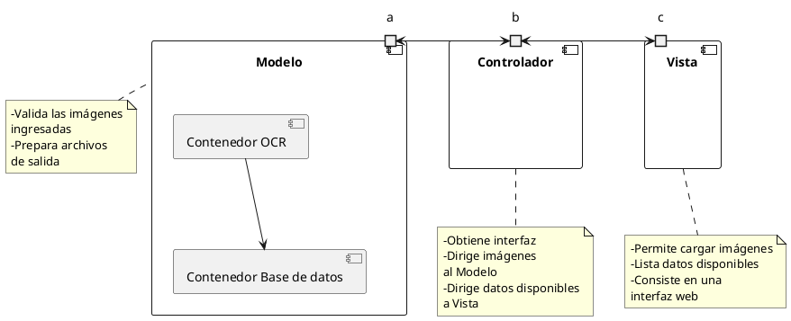

**Objetivo:**
	- Desarrollar un prototipo de sistema de registro contable que mediante un OCR obtenga los datos de una fotografía, y se salve todo en una base de datos.

El patrón de diseño es un MVC, que se especifica en el siguiente diagrama:

Es necesario aclarar que la interconexión entre las capas se lleva a cabo mediante un volumen de docker, esto porque la naturaleza del producto desarrollado (dígase un prototipo) requiere mostrar resultados en el tiempo definido, de disponer de un rango de tiempo mayor se podría implementar una base de datos SQL que permita su acceso por https, de modo que no sea necesaria la conexión entre volúmenes.